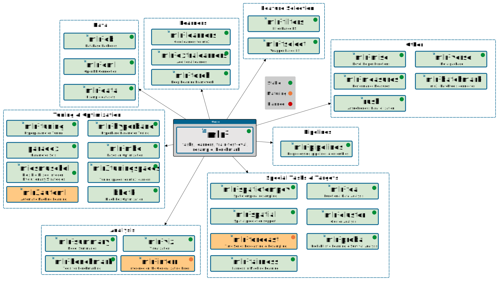

```{r, include = FALSE}
lgr::get_logger("mlr3")$set_threshold("warn")
set.seed(1)
options(datatable.print.class = FALSE, datatable.print.keys = FALSE)
```

# mlr3 

Package website: [release](https://mlr3.mlr-org.com/) | [dev](https://mlr3.mlr-org.com/dev/)

Efficient, object-oriented programming on the building blocks of machine learning.
Successor of [mlr](https://github.com/mlr-org/mlr).

<!-- badges: start -->
[](https://github.com/mlr-org/mlr3/actions)
[](https://doi.org/10.21105/joss.01903)
[](https://cran.r-project.org/package=mlr3)
[](https://stackoverflow.com/questions/tagged/mlr3)
[](https://lmmisld-lmu-stats-slds.srv.mwn.de/mlr_invite/)
<!-- badges: end -->

## Resources (for users and developers)

* We _started_ writing a [book](https://mlr3book.mlr-org.com/).
  This should be the central entry point to the package.
* The [mlr3gallery](https://mlr3gallery.mlr-org.com) has some case studies and demonstrates how frequently occurring problems can be solved.
  It is still in early days so stay tuned for more to come.
* [Reference manual](https://mlr3.mlr-org.com/reference/)
* [FAQ](https://github.com/mlr-org/mlr3/wiki/FAQ)
* Ask questions on [Stackoverflow (tag #mlr3)](https://stackoverflow.com/questions/tagged/mlr3)
* **Extension Learners**
  - Recommended core regression, classification, and survival learners are in [mlr3learners](https://github.com/mlr-org/mlr3learners)
  - All others are in [mlr3extralearners](https://github.com/mlr-org/mlr3extralearners)
  - Use the [learner search](https://mlr3extralearners.mlr-org.com/articles/learners/list_learners.html) to get a simple overview
  - Use the [learner status](https://mlr3extralearners.mlr-org.com/articles/learners/test_overview.html) to see their build status
* **Cheatsheets**
  - [Overview of cheatsheets](https://cheatsheets.mlr-org.com)
  - [mlr3](https://cheatsheets.mlr-org.com/mlr3.pdf)
  - [mlr3tuning](https://cheatsheets.mlr-org.com/mlr3tuning.pdf)
  - [mlr3pipelines](https://cheatsheets.mlr-org.com/mlr3pipelines.pdf)
* **Videos**:
  - [useR2019 talk on mlr3](https://www.youtube.com/watch?v=wsP2hiFnDQs)
  - [useR2019 talk on mlr3pipelines and mlr3tuning](https://www.youtube.com/watch?v=gEW5RxkbQuQ)
  - [useR2020 tutorial on mlr3, mlr3tuning and mlr3pipelines](https://www.youtube.com/watch?v=T43hO2o_nZw)
  - [Recorded talk about mlr3spatiotempcv and mlr3spatial at OpenDataScience Europe Conference 2021 in Wageningen, NL](https://av.tib.eu/media/55271)
* **Courses/Lectures**
  - The course [Introduction to Machine learning (I2ML)](https://introduction-to-machine-learning.netlify.app/) is a free and open flipped classroom course on the basics of machine learning. `mlr3` is used in the [demos](https://github.com/slds-lmu/lecture_i2ml/tree/master/code-demos-pdf) and [exercises](https://github.com/slds-lmu/lecture_i2ml/tree/master/exercises).
* **Templates/Tutorials**
  - [mlr3-learndrake](https://github.com/mlr-org/mlr3-learndrake): Shows how to use mlr3 with [drake](https://docs.ropensci.org/drake/) for reproducible ML workflow automation.
* [List of extension packages](https://github.com/mlr-org/mlr3/wiki/Extension-Packages)
* [mlr-outreach](https://github.com/mlr-org/mlr-outreach) contains public talks and slides resources.
* Our [blog](https://mlr-org.com/) about _mlr_ and _mlr3_.
  (We are not the most frequent bloggers ;) )
* [Wiki](https://github.com/mlr-org/mlr3/wiki):
  Contains mainly information for developers.

## Installation

Install the last release from CRAN:

```{r eval = FALSE}
install.packages("mlr3")
```

Install the development version from GitHub:

```{r eval = FALSE}
remotes::install_github("mlr-org/mlr3")
```

If you want to get started with `mlr3`, we recommend installing the [mlr3verse](https://mlr3verse.mlr-org.com/) meta-package which installs `mlr3` and some of the most important extension packages:
```{r eval = FALSE}
install.packages("mlr3verse")
```

## Example

### Constructing Learners and Tasks

```{r}
library(mlr3)

# create learning task
task_penguins = as_task_classif(species ~ ., data = palmerpenguins::penguins)
task_penguins

# load learner and set hyperparameter
learner = lrn("classif.rpart", cp = .01)
```

### Basic train + predict

```{r}
# train/test split
split = partition(task_penguins, ratio = 0.67)

# train the model
learner$train(task_penguins, split$train_set)

# predict data
prediction = learner$predict(task_penguins, split$test_set)

# calculate performance
prediction$confusion
measure = msr("classif.acc")
prediction$score(measure)
```

### Resample

```{r}
# 3-fold cross validation
resampling = rsmp("cv", folds = 3L)

# run experiments
rr = resample(task_penguins, learner, resampling)

# access results
rr$score(measure)[, .(task_id, learner_id, iteration, classif.acc)]
rr$aggregate(measure)
```

## Extension Packages

<a href="https://raw.githubusercontent.com/mlr-org/mlr3/main/man/figures/mlr3verse.svg?sanitize=true"></a>

Consult the [wiki](https://github.com/mlr-org/mlr3/wiki/Extension-Packages) for short descriptions and links to the respective repositories.

For beginners, we strongly recommend to install and load the [mlr3verse](https://mlr3verse.mlr-org.com/) package for a better user experience.

## Why a rewrite?

[mlr](https://github.com/mlr-org/mlr) was first released to [CRAN](https://cran.r-project.org/package=mlr) in 2013.
Its core design and architecture date back even further.
The addition of many features has led to a [feature creep](https://en.wikipedia.org/wiki/Feature_creep) which makes [mlr](https://github.com/mlr-org/mlr) hard to maintain and hard to extend.
We also think that while mlr was nicely extensible in some parts (learners, measures, etc.), other parts were less easy to extend from the outside.
Also, many helpful R libraries did not exist at the time [mlr](https://github.com/mlr-org/mlr) was created, and their inclusion would result in non-trivial API changes.

## Design principles

* Only the basic building blocks for machine learning are implemented in this package.
* Focus on computation here. No visualization or other stuff. That can go in extra packages.
* Overcome the limitations of R's [S3 classes](https://adv-r.hadley.nz/s3.html) with the help of [R6](https://cran.r-project.org/package=R6).
* Embrace [R6](https://cran.r-project.org/package=R6) for a clean OO-design, object state-changes and reference semantics. This might be less "traditional R", but seems to fit `mlr` nicely.
* Embrace [`data.table`](https://cran.r-project.org/package=data.table) for fast and convenient data frame computations.
* Combine `data.table` and `R6`, for this we will make heavy use of list columns in data.tables.
* Defensive programming and type safety.
  All user input is checked with [`checkmate`](https://cran.r-project.org/package=checkmate).
  Return types are documented, and mechanisms popular in base R which "simplify" the result unpredictably (e.g., `sapply()` or `drop` argument in `[.data.frame`) are avoided.
* Be light on dependencies. `mlr3` requires the following packages at runtime:
    - [`parallelly`](https://cran.r-project.org/package=parallelly):
      Helper functions for parallelization.
      No extra recursive dependencies.
    - [`future.apply`](https://cran.r-project.org/package=future.apply):
      Resampling and benchmarking is parallelized with the [`future`](https://cran.r-project.org/package=future) abstraction interfacing many parallel backends.
    - [`backports`](https://cran.r-project.org/package=backports):
      Ensures backward compatibility with older R releases. Developed by members of the `mlr` team.
      No recursive dependencies.
    - [`checkmate`](https://cran.r-project.org/package=checkmate):
      Fast argument checks. Developed by members of the `mlr` team.
      No extra recursive dependencies.
    - [`mlr3misc`](https://cran.r-project.org/package=mlr3misc):
      Miscellaneous functions used in multiple mlr3 [extension packages](https://github.com/mlr-org/mlr3/wiki/Extension-Packages).
      Developed by the `mlr` team.
    - [`paradox`](https://cran.r-project.org/package=paradox):
      Descriptions for parameters and parameter sets. Developed by the `mlr` team.
      No extra recursive dependencies.
    - [`R6`](https://cran.r-project.org/package=R6):
      Reference class objects.
      No recursive dependencies.
    - [`data.table`](https://cran.r-project.org/package=data.table):
      Extension of R's `data.frame`.
      No recursive dependencies.
    - [`digest`](https://cran.r-project.org/package=digest) (via `mlr3misc`):
      Hash digests.
      No recursive dependencies.
    - [`uuid`](https://cran.r-project.org/package=uuid):
      Create unique string identifiers.
      No recursive dependencies.
    - [`lgr`](https://cran.r-project.org/package=lgr):
      Logging facility.
      No extra recursive dependencies.
    - [`mlr3measures`](https://cran.r-project.org/package=mlr3measures):
      Performance measures.
      No extra recursive dependencies.
    - [`mlbench`](https://cran.r-project.org/package=mlbench):
      A collection of machine learning data sets.
      No dependencies.
    - [`palmerpenguins`](https://cran.r-project.org/package=palmerpenguins):
      A classification data set about penguins, used on examples and provided as a
      toy task.  No dependencies.
* [Reflections](https://en.wikipedia.org/wiki/Reflection_%28computer_programming%29): Objects are queryable for properties and capabilities, allowing you to program on them.
* Additional functionality that comes with extra dependencies:
    - To capture output, warnings and exceptions, [`evaluate`](https://cran.r-project.org/package=evaluate) and [`callr`](https://cran.r-project.org/package=callr) can be used.

## Contributing to mlr3

This R package is licensed under the [LGPL-3](https://www.gnu.org/licenses/lgpl-3.0.en.html).
If you encounter problems using this software (lack of documentation, misleading or wrong documentation, unexpected behavior, bugs, ...) or just want to suggest features, please open an issue in the [issue tracker](https://github.com/mlr-org/mlr3/issues).
Pull requests are welcome and will be included at the discretion of the maintainers.

Please consult the [wiki](https://github.com/mlr-org/mlr3/wiki/) for a [style guide](https://github.com/mlr-org/mlr3/wiki/Style-Guide), a [roxygen guide](https://github.com/mlr-org/mlr3/wiki/Roxygen-Guide) and a [pull request guide](https://github.com/mlr-org/mlr3/wiki/PR-Guidelines).

## Citing mlr3

If you use mlr3, please cite our [JOSS article](https://doi.org/10.21105/joss.01903):
```{r echo = FALSE, comment = ""}
toBibtex(citation("mlr3"))
```
